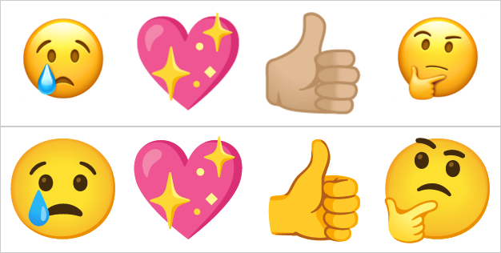

# Reaction-icon pipeline — Noto SVG → resvg → PNG

> Research asset for [Map: Regenerate the 9 reaction icons from Google emoji](https://github.com/sigma/callctl/issues/83),
> ticket [#84 Pin the Noto-emoji → PNG pipeline](https://github.com/sigma/callctl/issues/84). AFK research.
> Sources: [googlefonts/noto-emoji](https://github.com/googlefonts/noto-emoji) (`svg/` per-glyph vector sources),
> nixpkgs `resvg`, cross-checked against the shipped icons in
> `packages/plugin/dev.yrh.callctl.sdPlugin/imgs/actions/` and the glyph set in
> `packages/protocol/src/reactions.ts`.

## TL;DR

A **proven, nix-native, crisp** pipeline exists:

```
noto-emoji  svg/emoji_u<cp>.svg   (true vector, viewBox 0 0 128 128)
   │
   └─ resvg -w 144 -h 144  →  react_<slug>@2x.png   (144×144 RGBA)
   └─ resvg -w  72 -h  72  →  react_<slug>.png       ( 72×72  RGBA)
```

- **Rasterizer: `resvg`** (nixpkgs `resvg` 0.46, available on all four dev
  systems). Renders the Noto vector SVGs to crisp RGBA PNGs at *any* size — no
  upscaling, since the source is vector. All 9 glyphs verified to render at
  144×144. `librsvg`/`rsvg-convert` and ImageMagick are viable fallbacks but
  resvg has the best track record on Noto's SVGs and the smallest closure.
- **Asset source: the `svg/` per-glyph vector files** — *not* the repo's 128px
  PNGs (would need a blurry 128→144 upscale) and *not* the color font
  (`NotoColorEmoji.ttf` is a CBDT **bitmap** strike font — same upscaling
  problem, and nixpkgs `harfbuzz` ships **without** `hb-view`/cairo so there is
  no clean in-shell font-rasterization path anyway).
- **All 9 glyphs are single codepoints** — no ZWJ sequences, no skin-tone
  modifiers — so each slug maps to exactly one `emoji_u<cp>.svg`.

**⚠️ One decision must go back to the human before the build (#86):** the current
9 shipped icons are **not Google Noto at all** — they are a glossy, Apple-style
set. Rendering from Noto (any revision) therefore *restyles all 9* rather than
"matching the trio". See [Style divergence](#style-divergence-the-one-open-decision).

## Slug → codepoint table

Order matches Meet's on-screen bar (`REACTION_SLUGS`).

| slug       | glyph | codepoint | Noto source file      |
|------------|-------|-----------|-----------------------|
| `love`     | 💖    | U+1F496   | `svg/emoji_u1f496.svg` |
| `yes`      | 👍    | U+1F44D   | `svg/emoji_u1f44d.svg` |
| `party`    | 🎉    | U+1F389   | `svg/emoji_u1f389.svg` |
| `clap`     | 👏    | U+1F44F   | `svg/emoji_u1f44f.svg` |
| `laugh`    | 😂    | U+1F602   | `svg/emoji_u1f602.svg` |
| `surprise` | 😮    | U+1F62E   | `svg/emoji_u1f62e.svg` |
| `cry`      | 😢    | U+1F622   | `svg/emoji_u1f622.svg` |
| `think`    | 🤔    | U+1F914   | `svg/emoji_u1f914.svg` |
| `no`       | 👎    | U+1F44E   | `svg/emoji_u1f44e.svg` |

All 9 fetched HTTP 200 from `main` and rendered OK at 144×144.

## Exact command path (reproducible)

Per glyph, given the source SVG at `$SRC` and slug `$s`:

```sh
resvg -w 144 -h 144 "$SRC" "imgs/actions/react_${s}@2x.png"   # @2x
resvg -w  72 -h  72 "$SRC" "imgs/actions/react_${s}.png"      # 1x
```

Filenames are unchanged from today, so the manifest
(`Image: imgs/actions/react_<slug>`) needs **no edit**.

### Nix deps to add

- Add **`resvg`** to the devShell `packages` in `flake.nix` (plain
  `pkgs.resvg`; it is in the pinned nixpkgs — resolved 0.46.0 here).
- Provide the **Noto SVG sources** by pinning the repo as a flake input, e.g.
  `inputs.noto-emoji = { url = "github:googlefonts/noto-emoji"; flake = false; };`
  and reading `svg/emoji_u<cp>.svg` from it. This keeps the source revision
  pinned and reproducible (**which revision matters — see below**) instead of
  fetching from `raw.githubusercontent.com` at build time.

The generator recipe itself (standalone script vs. plugin build step; where the
slug→codepoint table lives) is the "Not yet specified" wiring question and is
downstream of this ticket — it does not change the pipeline above.

## Style divergence — the one open decision

The map's destination says both "**from Google (Noto) Color Emoji**" *and*
"**matching the look of the current `cry`/`surprise`/`think` trio**". Direct
evidence shows **these two goals conflict** — the trio (and the other six) are
*not* Noto:



*Top row: the shipped icons (`cry`, `love`, `yes`, `think`). Bottom row: the same
glyphs rendered from noto-emoji `main` via resvg.*

- The shipped icons are a **glossy, soft-gradient** set. `react_yes` even carries
  a **skin-tone-modified** thumb (👍🏼), which the wire glyph (`👍`, default
  yellow) never requests. This is Apple's house style, not Google's.
- I checked noto-emoji's `svg/` at three eras — none match the shipped look:
  - `main` / 2020+ → the **flat** redesign (bottom row above),
  - `v2017-05-18` → the **"blob"** faces,
  - the 2015 era → older blobs.
  So no revision of the Noto repo reproduces the glossy trio.
- The trio is "better" only in **canvas geometry** (all three are 144×144; the
  other six are 144×136) — *not* in glyph style. Confirmed by `file`. So the map
  author's premise that the trio and the six share a style holds; it's just that
  the shared style is Apple's, not Noto's.

**Consequence:** regenerating from Noto gives a **uniform, crisp, genuinely
Google-Noto** set of all 9 — satisfying "produced one identical way" — but it
**replaces** the current glossy look; it does not preserve it.

**Recommendation (for the human, gates #86):** adopt the **flat modern Noto**
(`main` svg + resvg) for all 9. It is the only clean, reproducible, in-nix path,
and uniformity was the actual problem (two inconsistent hand-exported batches).
The "match the trio" clause was written believing the trio was Noto; it isn't, so
no Noto pipeline can honour it. If preserving the glossy Apple look is a hard
requirement, that is a **different effort** — the source isn't Noto, isn't openly
distributed as vector, and likely carries licensing constraints — and should be
raised as such rather than folded into this map.

This does **not** block the pipeline decision (resvg + Noto SVG is settled). It
reframes the geometry ticket (#85) — "match the trio" becomes "pick a uniform
144×144 tile geometry" — and needs a one-line human confirmation before the
build (#86) commits pixels.

## Feasibility gate: PASS

The path renders all 9 glyphs crisply at 144×144 and 72×72 with tooling that is
entirely in nixpkgs. Samples committed under
`assets/reaction-icon-pipeline/` (`sample_react_cry@2x_main-flat.png`,
`sample_react_love@2x_main-flat.png`, and the comparison montage).
